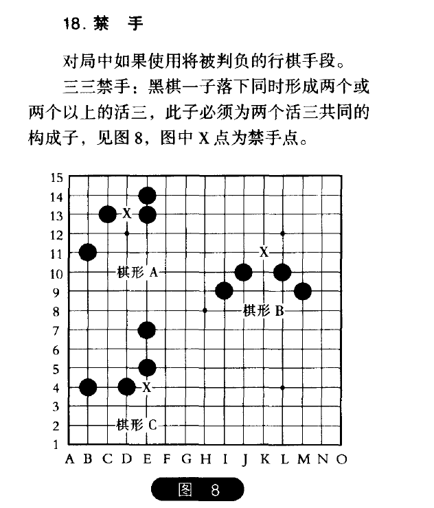
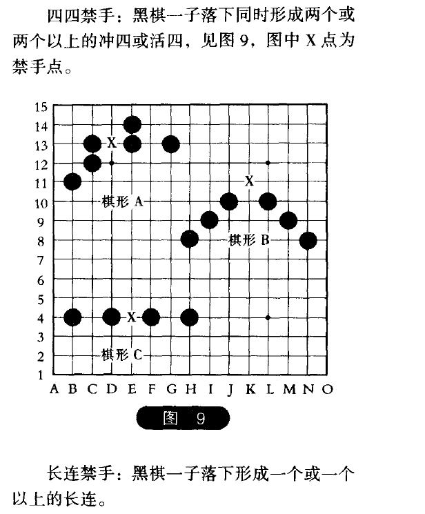

# 五子棋比赛规则

## 计时

1. 一局比赛限时 30 分钟，每一手落子时间控制在 15 秒内。
2. 若 15 秒内未落子，则警告一次；一局一方时限警告最多三次，裁判有权超时判负。
3. 比赛在 30 分钟内仍未分出胜负，双方休息 10 分钟后，可提出要求 5 / 10 分钟加时赛。

## 基本规则

1. 黑先、白后，从天元开始相互顺序落子。
2. 白棋第一手应在天元为界自己一侧布子，之后双方可任意行子。
3. 最先在棋盘横向、竖向、斜向形成连续的相同色五个棋子的一方为胜。
4. 黑棋禁手判负、白棋无禁手。黑棋禁手包括“三、三”“四、四”“长连”。黑方只能“四、三”胜。黑方出现禁手，无论是自愿或被迫走出，只要白方立即指出，则判白方胜。若白方在黑方出现禁手后未立即指出又落下一白子，则黑方禁手不再成立。
5. 如分不出胜负，则定为平局。
6. 对局中中途退场均判为负。
7. 五连与禁手同时形成，先五为胜。

## 棋型说明

1. **长连**：在一条直线或斜线上，连续下成五个以上的棋型。
2. **活三**：在一条直线或斜线上，由三个子构成的，必须防守否则将成为“活四”导致速胜的棋型。
3. **活四**：指在一条直线或斜线上，由连续的四个子所构成的，无论对方怎样防守，只要再走一手棋将必定成为五连的棋型。
4. **四**：在一条直线或斜线上，由四个同色子构成的，必须防守否则下一步立刻成为“五连”导致速胜的棋型。活四也是四之一。

## 特殊规则

黑棋先行的优势很大。因此，在五子棋中，对黑棋做了禁手限制。

**禁手**：对局中禁止使用的着法。黑棋禁手包括“三三禁手”“四四禁手”和“长连禁手”，白棋无禁手。

## 禁手的判断

1. **长连禁手**：当黑棋走一步棋，形成长连棋型，则此点为“禁手”。
2. **三三禁手**：当黑棋走一步棋，同时形成两个或两个以上的“活三”且没有形成“五连”时，那一步棋就是黑棋禁手。
3. **四四禁手**：当黑棋走一步棋，同时形成两个或两个以上的“四”且没有形成“五连”时，那一步棋就是黑棋禁手。

## 胜负判断

### 胜局

1. 最先在棋盘上形成五连，并得到系统认可的一方为胜。白棋长连视同五连。
2. 黑方五连与禁手同时形成，禁手失效，黑方胜。
3. 黑方被迫形成禁手，黑方输。
4. 对局中，一方出现下列情况之一，系统判对方胜：
   - 超过规定时限者；
   - 一方宣布认输者；
   - 中途退出比赛者（即逃跑者）。

### 和局

1. 对局双方一致同意和棋。
2. 对局双方同一回合均放弃行棋权。
3. 全盘均下满，已无空白交叉点。

### 提和

1. 欲提和者应在自己落子前提出。
2. 一方提和，对方可对提和建议表示同意，也可以拒绝。

## 附图：禁手图解

### 三三禁手

### 四四禁手

